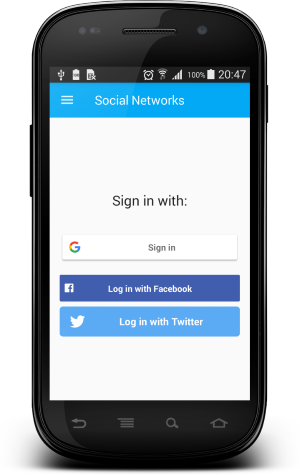
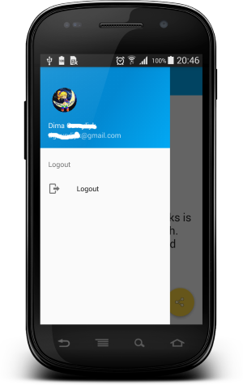
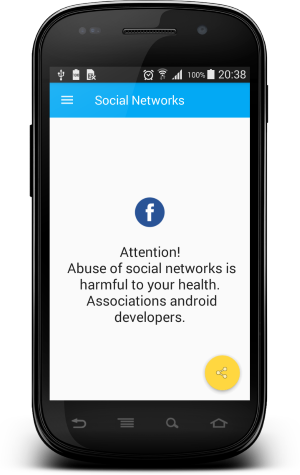

# Social Networks

A simple Android application that showcases autorization with Google, Twitter and Facebook.
 
In order for the application to work, you need to register it:
* Facebook https://developers.facebook.com/
* Twitter https://apps.twitter.com/
* Google https://console.cloud.google.com/
* Replace in the file api.gradle keys for your values

Login Fragment| Main Activity | Content Fragment
-------------|-----------------| -------------
  |  | 

Developed By
-------
Igor Havrylyuk (Graviton57)

[1]: https://github.com/graviton57/SocialNetworks.git
